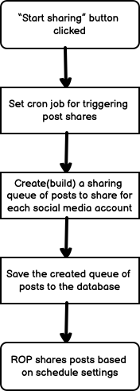

# Introduction

Revive Old Posts (ROP) works on the basis of creating a "queue" for each active social media account then grabbing posts (and/or custom post types) from the site's database, and filling the queue's timestamps with those posts.

When the cron job `rop_cron` hits, various logic is run to check if there are any posts to send out to the social media accounts.

This is the basic overview of how ROP works. 

In this doc, I will try to explain some of the plugin's logic to hopefully help you quicker get started with ROP development.

# Queuing Posts

Everytime the `rop_cron` scheduled event fires, the queue is built for every currently active social media account. Each account queue can hold 10 posts at a time, this is set by the constant: `EVENTS_PER_ACCOUNT`. 

By default the value for the `EVENTS_PER_ACCOUNT` constant is 10, so if any of the social media accounts do not have 10 posts in its queue at the time the schedule event fires, ROP will add the missing posts to meet that threshhold (logic explained further below). The class responsible for this is `Rop_Queue_Model`, particularly the `get_queue()` method. 

The queue is made up of the social media account IDs, the timestamps at which the share should happen, and the Post IDs that will be shared. A dump of this is visualized below:

In the example above the **"Number of Posts"** option in **"General Settings"** of ROP was left at *1*. If the number was increased to *2*, then the "posts" array would contain contain two post IDs.

## Selecting Which Posts Get Queued

During the building of the queue, ROP selects posts from the database using a query that is built according to the options set in "General Settings" of the plugin dashboard. 

The class responsible for this is the `Rop_Posts_Selector_Model`, when the `select()` method runs(called by the `get_queue()` method), it does the following:

- Get the Post types that should be queried.
- Get the taxonomies (categories and tags) that should be included/excluded from the pool.
- Get the posts that have been excluded by the user using the "Exclude Posts" feature.
- Get posts that have already been shared.
- Query the database with the generated query to create the pool of post IDs that are eligible to be added (**randomly**) to the queue of the active social media accounts.

&nbsp;
### Below is a general overview of what happens when the "Start Sharing" button is first clicked
&nbsp;
&nbsp;

# Sharing Posts

During the initial click of the "Start Sharing" button, ROP sets a scheduled event(cron job) called `rop_cron`, this scheduled event is fired **every 5 minutes**, and runs the method `rop_cron_job()` located in the `Rop_Admin` class. This is the method that kicks off the building of the queue. 

Once the queue has been built and the sharing is active, the `rop_cron` scheduled task will continue to be fired every 5 minutes.

If there are any timestamps in the past when the `rop_cron_job()` method is called, then ROP will start the process of sharing the post(s) in the queue to social media.

It will build the service object for the social media services and run the `share()` method located in every social media's service class file.

This `share()` method is what sends out the actual post share to social media and then returns a success or error message.

The `rop_cron_job()` method will also remove the shared post's ID(s) from the sharing queue as well as update the **Post Buffer** with the post ID(s) that were just shared. 

The next time the `rop_cron` event fires, the `get_queue()` method's logic will notice that the queue for the respective account no longer has 10 posts, so it will fill the missing slots with posts queried by the `Rop_Posts_Selector_Model::select()` method.

&nbsp;
### Below is an overview of the autopilot sharing process
&nbsp;
&nbsp;

# Posts Buffer

The post buffer acts as a "bucket" for all the posts that have been shared to the social media accounts. It is used during the queue building process to also sift out posts that have already been shared so that the query to grab posts from the database does not grab post IDs that have already been shared; See `Rop_Posts_Selector_Model::build_exclude()`

# Miscellaneous

The ROP dashboard is built using VueJS. The saving of the options are done using the WP REST API. This means that if the WP REST API is not working on the user's website, or a security plugin is blocking access, then ROP settings would not be saved.

The class responsible for faciliating clientside interations with the server is `Rop_Rest_Api`