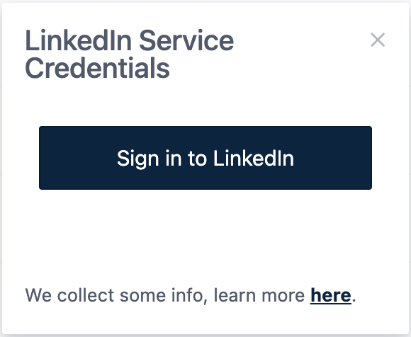
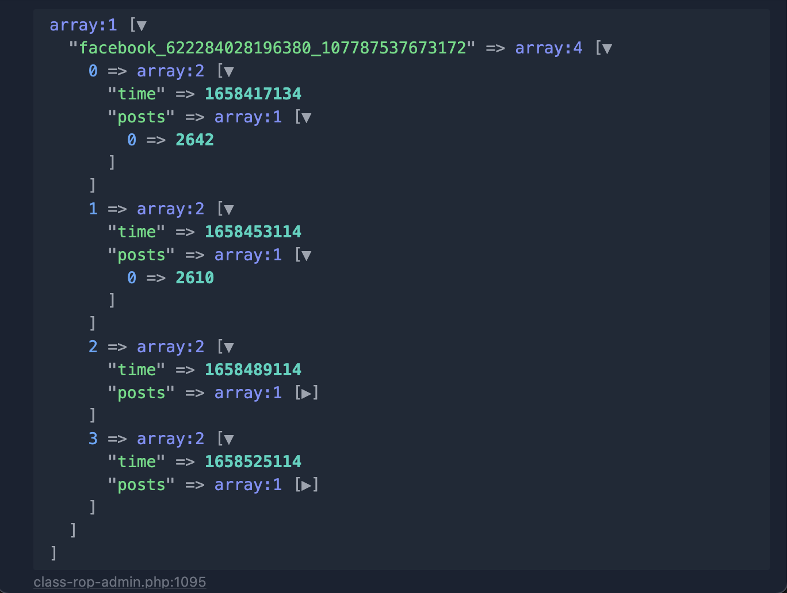
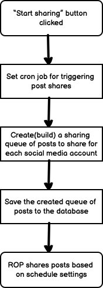
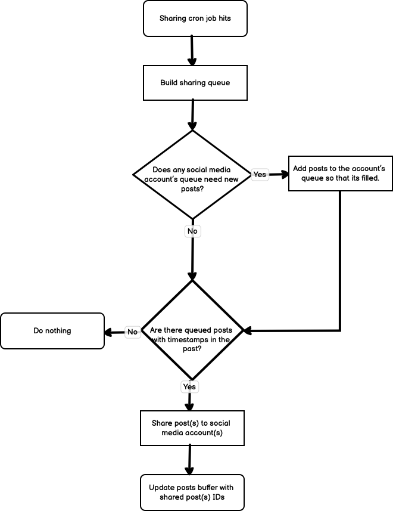
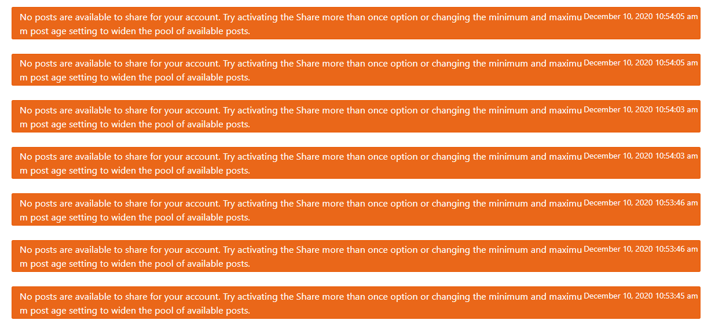

# Introduction

Revive Old Posts (ROP) is the one of the first plugins acquired by Themeisle. Before the acquisition the main purpose of the plugin was simply sharing WordPress posts to Twitter. Since then, it's received some new networks and in v8.0 received a major rewrite of it's code to bring it up to speed.

Since then, at around v8.x the plugin's active development and improvement has slowed and there are is lot of room for improvement.

Some of those things include:

### 1) Removal of the dead code that exists in the plugin

In previous versions of ROP, users were allowed to connect their own developer apps to the plugin and which ROP would then use to acquire the **access token** for sharing.

During the Facebook Cambridge Analytica saga, we realized that this was not the best way to go about things since Facebook required every owner of an App to go through a tedious review process which most got declined for resulting in a loss of ~10k active installs.

From that incident we started getting our own Developer Apps from the social media networks, and allowing users to connect via app.revive.social to receive access tokens for posting.

The current released version of the plugin still has the code which handles users adding their own API key and secret, however, the fields aren't being shown and users only see a "Connect using [Social media network]" button:



Though some of ROP's networks had this functionality before (users being able to connect their own apps), the newer networks were added without that ability and users are only able to connect using our developer app via app.revive.social. These networks are:

- Google My Business
- Vkontakte

[A pull request](https://github.com/Codeinwp/tweet-old-post/pull/849) exists where most of the dead code relating to the old way of connecting apps have been removed. It has not yet been merged out of concerns that some users are still using the old method.

### 2) Remove or work on remote cron features

The ROP plugin has code to facilitate a remote cron system that we piloted but had to stop because of multiple issues and bugs. The code for this cron system still exists in the plugin but it's not currently doing anything. The goal was to create a system that would send out pings to user's websites to fire the ROP share instead of relying on their WP CRON thus enhancing the user experience for sites with low traffic. The accompanying plugin for this exists on app.revive.social and it as well is disabled.

### 3) Rewrite the Auth Service App

As mentioned previously, when a user connects their social media account to the ROP plugin, the request goes through `app.revive.social` where the authorization tokens are created and sent back to the user's website where it is saved.

The plugin for facilitating this workflow exists on the `app.revive.social` website.

The plugin was first created to only facilitate the connecting of Facebook accounts after the Cambridge Analytica scandal but grew afterwards to support all of the networks provided by ROP. The thing is, in it's current procedural programming form, it's not ideal. The plugin should ideally be rewritten and made more easily extendable.

[The repository can be found here.](https://github.com/Codeinwp/rop-auth-service)

### 4) Improve the Revive Network Plugin

Revive Network was a totally separate plugin introduced to the Revive Social lineup. However, it fell by the wayside as ROP gained far more popularity than it.

The plugin was reimagined and rewritten in [v2.0.0](https://github.com/Codeinwp/revive-network/pull/193) to work as an Add-on to ROP.

It's main purpose now is to pull in items from RSS feeds, save them to the website as a Custom Post Type, and then in ROP those posts can be shared to social media by selecting the post type from the General Settings of ROP.

This introduced new opportunities for ROP to grow and bring out the idea of keeping social media followers engaged with not only content from the website owner but also any other website with an RSS feed.

### 5) Automatically refresh LinkedIn Tokens.

Right now a user needs to go back to their ROP dashboard and refresh the LinkedIn token after it has expired. This is because there was no way to automatically refresh a LinkedIn token automatically at the time the network was added to ROP.

This is now possible, but the current library we are using for LinkedIn, does not support it. There is a pull request available on the library to allow this, but the library looks abandoned: https://github.com/zoonman/linkedin-api-php-client/pull/56

Two possible solutions exist here:

1 - Use the a forked version of the library that has the refresh token capability.
2 - Implement this manually with code and abandon using the library since it seems to be abandoned. We are already doing some LinkedIn API work manually in some parts of the ROP Auth Plugin.

An issue for this was created here: https://github.com/Codeinwp/tweet-old-post-pro/issues/397

# The Rundown

ROP works on the basis of creating a "queue" for each active social media account then grabbing posts (and/or custom post types) from the site's database, and filling the queue's timestamps with those posts.

When the cron job `rop_cron` hits, various logic is run to check if there are any posts to send out to the social media accounts.

This is the basic overview of how ROP works.

In this doc, I will try to explain some of the plugin's logic to hopefully help you quicker get started with ROP development.

# Connecting Social Media Accounts to ROP

When the "Connect to [network]" button is clicked, a window pointing to the endpoint for authenticating that network opens on `app.revive.social` via `window.open` in the browser.

Some logic is ran to send the user to the login page of the social network where they can then authorize our Developer App to post content to their website.

The plugin responsible for this logic exists on the `app.revive.social` website and it's called "ROP Authentication Service" [The repository can be found here.](https://github.com/Codeinwp/rop-auth-service).

The files responsible for this workflow are called `[shortname]_login.php`. Example, if the user tried to connect Facebook, then the file responsible for authenticating the user and sending back their `access token` to their website would be `fb_login.php`.

> [!NOTE]
> X/Twitter accounts can use a local mode in which they directly put the app credentials without login on `app.revive.social`. Since our app has a low limit for posting, users are advised to use their own keys.

Once the authentication workflow has completed, the `access_token` (and possibly also a `refresh token` depending on the network) as well as the account details will be sent back to the user's website (via `window.postMessage`) where ROP will be responsible for saving those details to the database.

The methods responsible for kickstarting the saving process exists in the `Rop_Rest_Api` class. In the example above, the method responsible for this would be `add_account_fb()`. This method calls the respective `add_account_with_app()` in the service file to setup the account details for saving to the database.

The account data is saved in `wp_options` table with the option name `rop_data`.

The service authentication data structure is as follows:

```json
{
  "gmb_10...": {
    "id": "10...",
    "service": "gmb",
    "credentials": {
      "created": 1705930287,
      "expires_in": 3599,
      "access_token": "ya29...",
      "refresh_token": "1//05o..."
    },
    "available_accounts": {
      "gmb_10.../10.../locations/80...": {
        "account": "Rob...",
        "user": "Location: Tes...",
        "created": "22/01/2024 12:11",
        "id": "accounts/10.../locations/80...",
        "active": false,
        "is_company": false,
        "img": "",
        "service": "gmb",
        "link": "https://business.google.com/"
      }
    }
  },
  "twitter_aT...": {
    "id": "aT...",
    "service": "twitter",
    "credentials": {
      "rop_auth_token": "73..."
    },
    "public_credentials": {
      "consumer_key": {
        "name": "API Key",
        "value": "",
        "private": false
      },
      "consumer_secret": {
        "name": "API secret key",
        "value": "",
        "private": true
      }
    },
    "available_accounts": {
      "twitter_aT...": {
        "account": "Revive Social 123",
        "user": "@RoPTest123",
        "created": "20/02/2024 13:25",
        "id": 73,
        "active": true,
        "is_company": false,
        "img": "https://pbs.twimg.com/profile_images/743.../UUkDCWSA_normal.jpg",
        "service": "twitter",
        "link": "https://twitter.com/..."
      }
    }
  },
  "facebook_12...": {
    "id": "12...",
    "service": "facebook",
    "credentials": null,
    "available_accounts": {
      "facebook_12...": {
        "account": "robert...",
        "user": "Page Testing 2",
        "created": "20/02/2024 13:46",
        "id": "18...",
        "active": true,
        "is_company": false,
        "img": "",
        "service": "facebook",
        "link": "https://facebook.com/185...",
        "access_token": "EA..."
      },
      "facebook_12...": {
        "account": "robert...",
        "user": "RoP Testing",
        "created": "20/02/2024 13:46",
        "id": "18...",
        "active": false,
        "is_company": false,
        "img": "",
        "service": "facebook",
        "link": "https://facebook.com/188...",
        "access_token": "EA..."
      }
    }
  }
}
```

> [!NOTE]
> For users who use X/Twitter sharing via ROP app, the posting is via proxy located in the `app.revive.social` server. The `rop_auth_token` (which is a token created by us) is used to authenticate the user's request to post on X/Twitter.

# General Settings and Post Format

The General Settings of ROP is where the user can set the frequency of sharing, the number of posts to share, the post types to share, and the taxonomies to include/exclude. The Dashboard is made with VueJS and the source code is in `vue/src` with exception of `vue/src/vue-elements/pro` which hooked inside the Gutenberg editor.

The settings value are saved inside option `rop_data` under the `general_settings` and `post_format` keys. While General Settings applies to all social media accounts, Post Format applies to each social media account individually.

General Settings data structure:

```json
{
  "default_interval": 10,
  "min_interval": 0.050000000000000003,
  "step_interval": 0.10000000000000001,
  "minimum_post_age": 0,
  "maximum_post_age": 5,
  "number_of_posts": 3,
  "more_than_once": false,
  "available_post_types": [
    {
      "name": "Posts",
      "value": "post",
      "selected": true
    },
    {
      "name": "Pages",
      "value": "page",
      "selected": false
    },
    {
      "name": "Custom Layouts",
      "value": "neve_custom_layouts",
      "selected": false
    }
  ],
  "selected_post_types": [
    {
      "name": "Posts",
      "value": "post",
      "selected": true
    }
  ],
  "available_taxonomies": [
    {
      "name": "Category: Uncategorized",
      "value": 1,
      "tax": "category",
      "selected": false
    }
  ],
  "selected_taxonomies": [],
  "exclude_taxonomies": false,
  "available_posts": [],
  "selected_posts": [],
  "exclude_posts": true,
  "ga_tracking": true,
  "beta_user": false,
  "remote_check": false,
  "custom_messages": false,
  "custom_messages_share_order": false,
  "instant_share": true,
  "instant_share_default": true,
  "start_time": 1706886799,
  "minute_interval": 5,
  "available_shorteners": {
    "bit.ly": {
      "id": "bit.ly",
      "name": "bit.ly",
      "active": true
    },
    "is.gd": {
      "id": "is.gd",
      "name": "is.gd",
      "active": true
    }
  }
}
```

Post format data structure:

```json
{
  "twitter_aTo3M....": {
    "wpml_language": "",
    "post_content": "post_title",
    "custom_meta_field": "",
    "maximum_length": "240",
    "custom_text": "",
    "custom_text_pos": "beginning",
    "include_link": true,
    "url_from_meta": false,
    "url_meta_key": "",
    "short_url": false,
    "short_url_service": "is.gd",
    "hashtags": "no-hashtags",
    "hashtags_length": "200",
    "hashtags_common": "",
    "hashtags_custom": "",
    "hashtags_randomize": false,
    "shortner_credentials": [],
    "image": false,
    "utm_campaign_medium": "social",
    "utm_campaign_name": "ReviveOldPost"
  },
  "facebook_122110....": {
    "wpml_language": "",
    "post_content": "post_title",
    "custom_meta_field": "",
    "maximum_length": "1000",
    "custom_text": "",
    "custom_text_pos": "beginning",
    "include_link": true,
    "url_from_meta": false,
    "url_meta_key": "",
    "short_url": false,
    "short_url_service": "is.gd",
    "hashtags": "no-hashtags",
    "hashtags_length": "200",
    "hashtags_common": "",
    "hashtags_custom": "",
    "hashtags_randomize": false,
    "shortner_credentials": [],
    "image": false,
    "utm_campaign_medium": "social",
    "utm_campaign_name": "ReviveOldPost"
  }
}
```

# Queuing Posts

Every time the `rop_cron` scheduled event fires, the queue is built for every currently active social media account. Each account queue can hold 10 posts at a time, this is set by the constant: `EVENTS_PER_ACCOUNT`.

By default the value for the `EVENTS_PER_ACCOUNT` constant is 10, so if any of the social media accounts do not have 10 posts in its queue at the time the schedule event fires, ROP will add the missing posts to meet that threshold (logic explained further below). The class responsible for this is `Rop_Queue_Model`, particularly the `get_queue()` method.

The queue is made up of the social media account IDs, the timestamps at which the share should happen, and the Post IDs that will be shared. A dump of this is visualized below:



In the example above the **"Number of Posts"** option in **"General Settings"** of ROP was left at _1_. If the number was increased to _2_, then the "posts" array would contain contain two post IDs.

## Selecting Which Posts Get Queued

During the building of the queue, ROP selects posts from the database using a query that is built according to the options set in "General Settings" of the plugin dashboard.

The class responsible for this is the `Rop_Posts_Selector_Model`, when the `select()` method runs(called by the `get_queue()` method), it does the following:

- Get the Post types that should be queried.
- Get the taxonomies (categories and tags) that should be included/excluded from the pool.
- Get the posts that have been excluded by the user using the "Exclude Posts" feature.
- Get posts that have already been shared.
- Query the database with the generated query to create the pool of post IDs that are eligible to be added (**randomly**) to the queue of the active social media accounts.

&nbsp;

### Below is a general overview of what happens when the "Start Sharing" button is first clicked

&nbsp;
&nbsp;



# Sharing Posts

During the initial click of the "Start Sharing" button, ROP sets a scheduled event(cron job) called `rop_cron`, this scheduled event is fired **every 5 minutes**, and runs the method `rop_cron_job()` located in the `Rop_Admin` class. This is the method that kicks off the building of the queue.

Once the queue has been built and the sharing is active, the `rop_cron` scheduled task will continue to be fired every 5 minutes.

If there are any timestamps in the past when the `rop_cron_job()` method is called, then ROP will start the process of sharing the post(s) in the queue to social media.

All the class services are located in the `includes/services` directory and they contain all the logic for interacting with the social media networks via their respective APIs.

> [!NOTE]
> For interacting with the API we use SDK or wrapper libraries. For example, for Facebook we use the `Facebook SDK`, for LinkedIn we use the `LinkedIn API PHP Client`, and for X/Twitter we use the `Abraham\TwitterOAuth` library. We need to pay attention when the API changes because the current version of the library might not support the changes.

It will build the service object for the social media services and run the `share()` method located in every social media's service class file.

This `share()` method is what sends out the actual post share to social media and then returns a success or error message.

The `rop_cron_job()` method will also remove the shared post's ID(s) from the sharing queue as well as update the **Post Buffer** with the post ID(s) that were just shared.

The next time the `rop_cron` event fires, the `get_queue()` method's logic will notice that the queue for the respective account no longer has 10 posts, so it will fill the missing slots with posts queried by the `Rop_Posts_Selector_Model::select()` method.

&nbsp;

### Below is an overview of the autopilot sharing process

&nbsp;
&nbsp;



# Posts Buffer

The post buffer acts as a "bucket" for all the posts that have been shared to the social media accounts. It is used during the queue building process to also sift out posts that have already been shared so that the query to grab posts from the database does not grab post IDs that have already been shared; See `Rop_Posts_Selector_Model::build_exclude()`

# Miscellaneous

The ROP dashboard is built using VueJS. The saving of the options are done using the WP REST API. This means that if the WP REST API is not working on the user's website, or a security plugin is blocking access, then ROP settings would not be saved.

# Publish Now

The "Publish Now" feature in ROP is a feature that allows the user to share a post to social media immediately after publish the post. The feature is available in the post editor (Gutenberg and Elementor) and it is located in the `edit-post-meta-boxes-area` container in Gutenberg (usually in `Post` tab of the sidebar for page settings).

The featured is rendered using VueJS and the source code is located in `vue/src/vue-elements/pro/publish-now`. The processing of the form options is done using the function `maybe_publish_now()` (in the `Rop_Admin` class) which is hooked to the `save_post` action.

The class responsible for facilitating client-side interactions with the server is `Rop_Rest_Api`

# Quirks

## Services Permission and Quota

The services API is not always stable, sometime they implement new permission or quota limit.

For permission, usually the user might need to re-authenticate the app to get the new permission or/and we must update the app to request the new permission.

When it comes to quota limit, we need to better handle the number of requests and stop any further requests if the limit is reached.

Related issues:

- [Facebook (Permission Issue)](https://github.com/Codeinwp/tweet-old-post-pro/issues/489)
- [X/Twitter (Quota Limit)](https://github.com/Codeinwp/themeisle/issues/1605)

## X/Twitter Integration

We offer the ability to share to X/Twitter via our app or via the user's own app. Since our app has a low limit for posting, users are advised to use their own keys.

When using our app, the `app.revive.social` return an authentication token (`rop_auth_token`) that is used to identify the saved oauth credentials in the server database. If the user uses their own app, then oauth credentials are saved locally in `rop_data` option. This flow can be seen in the `add_account_tw()` method in the `Rop_Rest_Api` class.

The share function have the same logic for both cases, if `rop_auth_token` is present, then the share is done via our app -- we make a POST request to the path stored in `ROP_POST_ON_X_API` and sending the `rop_auth_token` along with the post data. If the `rop_auth_token` is not present, then the share is done via the user's own app -- we make a direct request to the X/Twitter API using the `\Abraham\TwitterOAuth\TwitterOAuth` library.

One limitation for sharing via our app is that we do not allow sharing posts with images. The uploading images workflow is only present in the plugin.

> [!NOTE]
> The lib`\Abraham\TwitterOAuth\TwitterOAuth` is also used in our server endpoint for posting to X/Twitter. The same handling is used in both server and plugin. If you change the flow in the plugin, you should also change the server endpoint if necessary.

## Debug Logs

To display information logs made by `$logger->info()` in the dashboard on `Sharing Logs` tab, you need to set the `ROP_DEBUG` constant to `true` in the `tweet-old-post.php` file.

## Staging Environment

If you are working on a local instance (localhost), the environment will be considered as "staging" and the plugin will not send the posts to social media.
The function that control this behavior is `rop_site_is_staging` and it's located in `includes/admin/class-rop-admin.php`.

You can disable it temporarily by making it to return `false`:

## Log error about no posts gets triggered repeatedly.

When no posts are available to be used by ROP, logs an error. Since the cron job for triggering shares fires every 5 minutes, this error also shows over and over in the log until posts become available:



This error is triggered [here.](https://github.com/Codeinwp/tweet-old-post/blob/v9.0.9/includes/admin/models/class-rop-queue-model.php#L219)
